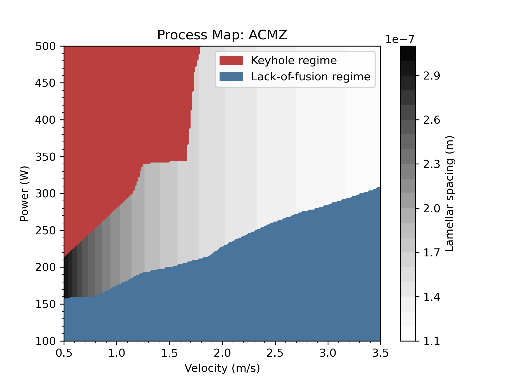

# Ramen: Rapid Alloy Models for Enhanced desigN
Ramen is a Python library for inexpensive analytic and semi-analytic models for process-structure-property calculations for alloys. Ramen also includes plotting tools for creating process maps. It uses [Mist](https://github.com/ORNL-MDF/mist) as the underlying data structure for inputs.

## Installing Ramen
```
# First install mist
$ git clone https://github.com/ORNL-MDF/mist
$ cd mist
$ pip install .
# Now install ramen
$ git clone https://github.com/ORNL-MDF/ramen
$ cd ramen
$ pip install .
```

## Running the examples
First go to the examples directory:
```
$ cd examples
```

To run the process-structure-property calculation for Al-Cu, run:
```
$ python AlCu_eutectic.py
```

To run the process mapping calculation for ACMZ, run:
```
$ python acmz_process_map.py
```
The output process map from that second example is:


